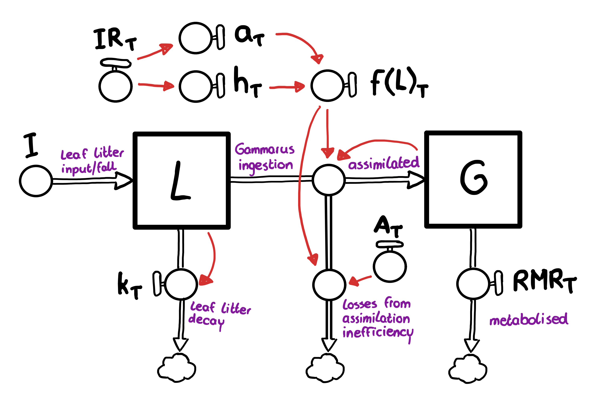
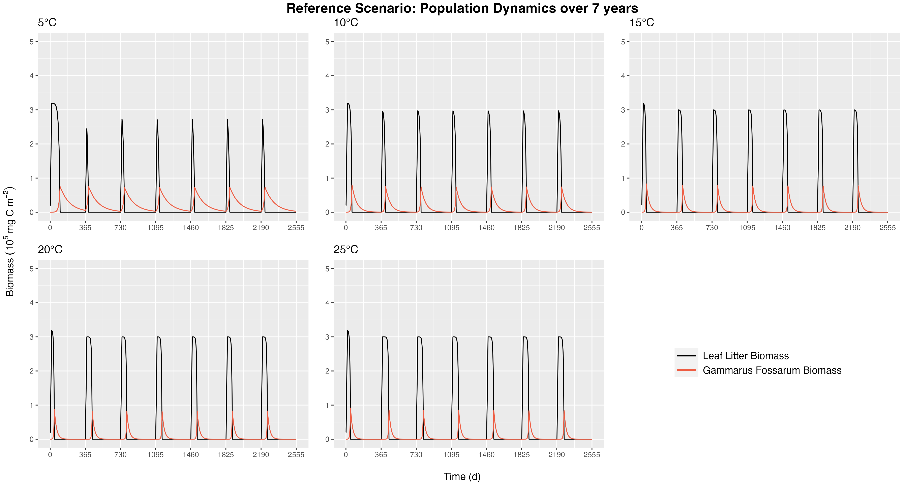
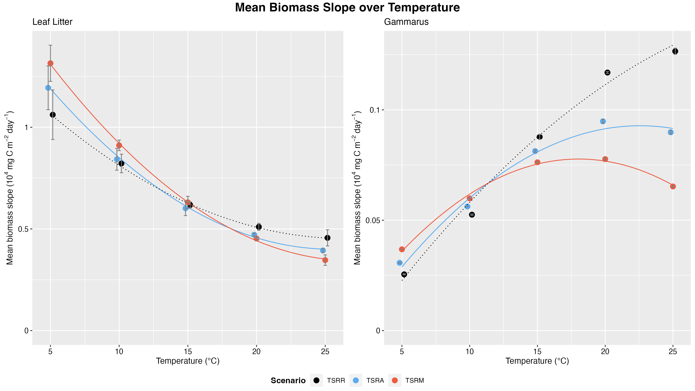
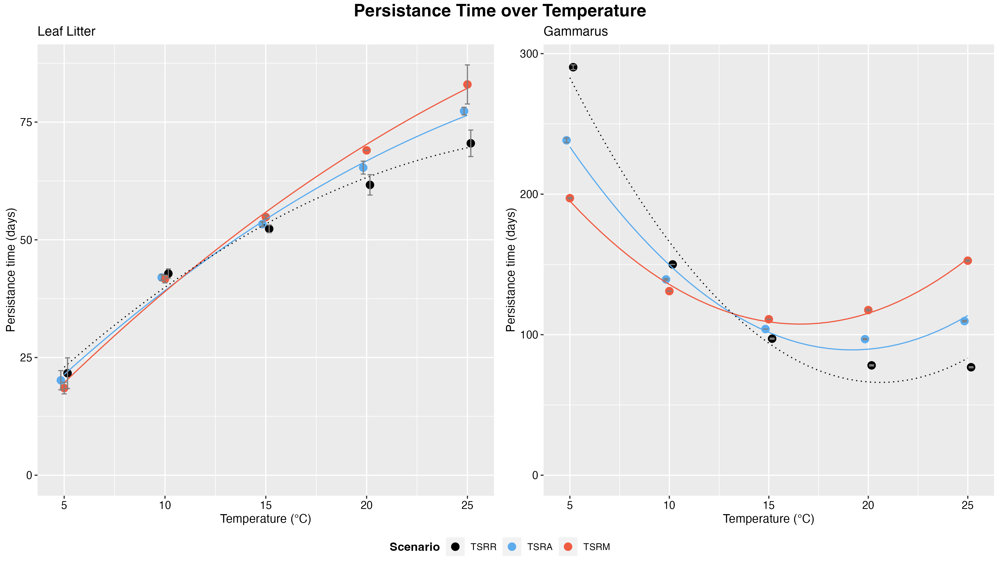

---
output:
  pdf_document:
    includes:
      in_header: report_subfiles/import.tex
      before_body: report_subfiles/before_body.tex

bibliography: report_subfiles/references.bib
citation-style: report_subfiles/ieee.csl
link-citations: true
nocite: '@*'
---

```{r, include=FALSE}
# Copyright (c) 2023 Vincent Talen.
# Licensed under GPLv3. See LICENSE file.
```

```{r setup, include=FALSE}
knitr::opts_chunk$set(echo = FALSE)
knitr::opts_chunk$set(warning = FALSE)
knitr::opts_chunk$set(fig.align = "center")
knitr::opts_chunk$set(fig.pos = "H", out.extra = "")
```

\newpage
<!-- (Introduction) -->
# Introduction
Climate change is a rising threat to the earth, the average overall surface temperature is predicted to increase by 0.2°C per decade and up to 2–5°C by the end of this century, leading to massive disruptions at all levels of biological organization across ecosystems *[@Dawson2011; @Walther2002]*. Life-history traits, population dynamics, species interactions and ecological processes are strongly influenced by temperature *[@Dell2011; @Sommer2012; @Woodward2010]*, especially physiological traits related to energy acquisition and expenditure *[@Brown2004]*, such as metabolic rate *[@Dillon2010; @Marshall-McQuaid2011]* and ingestion rate *[@Rall2012; @Vucic-Pestic2011]*, which together determine the energy balance of organisms. Furthermore, most organisms are ectotherms *[@Bickford2011]* on who temperature has an even greater effect *[@Angilletta2002]*, thus a key in understanding ecosystems' response to global warming is understanding the thermal physiology of ectotherms *[@Deutsch2008]*.

A powerful framework to investigate ecosystem functioning in the context of global warming is the Metabolic Theory of Ecology (MTE) *[@Brown2004]*. It combines the effects of body mass and temperature on biochemical processes in order to predict individual physiological performances *[@Gillooly2001; @West2003]*, this can then be scaled up from individuals to population, community and ecosystem levels *[@Allen2005]*. As metabolic losses increase exponentially with warming, organisms generally increase energy supply through nutrient ingestion *[@Sentis2012; @Lemoine2014]*, but metabolism increases more rapidly than nutrient ingestion with temperature. The resulting mismatch causes a decreasing energetic efficiency as temperature rises *[@Bideault2021]*, but has not been studied or measured directly.

Despite the functional significance and vulnerability to warming of detritivore populations *[@Boyero2012; @Wenisch2017]*, most studies on the impact of global warming on consumer-resource dynamics have mainly focused on carnivore and herbivore populations. Detritivores are heterotrophs that consume plant litter and decompose them into smaller inorganic molecules, performing what is called the first stage of remineralisation. These inorganic compounds can then be used by primary producers, such as plants and algae, to synthesize new organic molecules, completing the nutrient cycle in the ecosystem. Thus, leaf litter decomposition by detritivores is a crucial process in the ecosystem as it allows the nutrients stored in organic matter to be recycled and reused by other organisms.

Previous studies have not yet fully explained how thermal constraints on detritivores scale up to their entire ecosystems. Thermal bio-energetic models are greatly relevant for studying the impact of temperature and body size changes on detritivore-resource dynamics *[@Bernhardt2018; @Osmond2017; @Sentis2017]* and understanding the balance between key physiological processes that determine detritivore fitness *[@Jabiol2020]* is crucial for predicting the responses of populations and freshwater ecosystems to global warming *[@Bideault2021; @Demars2011; @Yvon-Durocher2010]*.

The goal of this research is to reproduce and improve on the research done by *Réveillon et al. [@Réveillon2022]* on the modelling of the consumer-resource dynamics by greatly improving the model code written in R, resulting in better reproducibility of this research and it being more easily expandable. *Réveillon et al.* investigated the thermal energetic mismatch between energy demand (i.e. metabolic rate) and supply (i.e. ingestion rate) and simulated the consequences of this thermal mismatch for seasonal population dynamics and carbon fluxes *[@Réveillon2022]*.


\newpage
<!-- (Theory/Model) -->
## Theory
The consumer-resource model created by *Réveillon et al.* describes the seasonal dynamics of *Gammarus Fossarum* and Leaf Litter biomasses in a temperate stream, a diagram showing an overview of the system dynamics can be seen below in Figure \ref{fig:model_diagram}. Even though the model assumes that all individuals of the population have the same body mass, the exploration on the effects of temperature-induced changes in population body size is still possible. The fluctuation in Gammarus population biomass is driven by the balance between carbon intake through food ingestion and carbon loss through respiration. Changes in leaf litter biomass are due to herbivory pressure of Gammarus on seasonal litter fall stock.

```{r model_diagram, out.width = "75%", fig.cap = "Diagram showing dynamics of the model (Made by Vincent Talen)"}

```

<!-- (State variables) -->
### State variables
The model has two state variables, leaf litter standing stocks ($L$) and *Gammarus* population biomass ($G$), both in in $mg\:C/m^2$. Both state variables have an ordinary differential equation (ODE) that describes their temporal change, Equation \ref{eq:odeleaflitter} and \ref{eq:odegammaruspopulation} respectively.

\odeleaflitter
\odegammaruspopulation

The standing stock of leaf litter is sustained by the seasonal leaf litter fall inputs ($I$) and decreases due to feeding activity by the *Gammarus* population ($f(L)_T\:G$) and litter decomposition ($k_T\:L$) by other degradation processes (e.g. microbial decomposition and leaching). Dynamics of the *Gammarus* population is described as the balance of carbon intake through litter ingestion ($f(L)_T\:A_T$) and loss through respiration ($RMR_T$), henceforth Routine Metabolic Rate ($RMR$). Each of the parameters of these two ODEs is described by their own equation and dependent on temperature, except for leaf litter input, all parameters are shown in Table \ref{tab:State-Variable-Parameters} below.

| Parameter           | Equation | Unit                              | Explanation
|----                 |---       |-----------                        |--------------------
| $I$                 | -        | $mg\:C \: m^{2}$                  | Leaf litter input
| $f(L)_{\mathrm{T}}$ | 2        | $mg\:C \: mg\:C^{-1} \: day^{-1}$ | Gammarus functional response
| $RMR_{\mathrm{T}}$  | 3b       | $mg\:C/day$                       | Gammarus routine metabolic rate
| $A_{\mathrm{T}}$    | 4        | -                                 | Gammarus assimilation efficiency
| $k_{\mathrm{T}}$    | 5        | $day^{-1}$                        | Leaf litter microbial decomposition
Table: Model state variables' parameters \label{tab:State-Variable-Parameters}

<!-- (Parameters) -->
### Parameter equations
The first parameter that is used in both differential equations is the *Gammarus* population feeding rate, which follows the Holling type II functional response (Equation \ref{eq:hollingtypetwo}).

\hollingtypetwo

with $a_{\mathrm{T}}$ being the *Gammarus* attack rate on leaves ($mg^{-2}/day$), $h_{\mathrm{T}}$ the *Gammarus* handling time ($day^{-1}$), both at temperature $T$, and with $L$ being the leaf litter biomass in $mg\:C/m^2$. Attack rate is estimated by assuming that the proportion of ingested leaf litter follows an exponential decay of time, which can be calculated as $DC_{\mathrm{T}} = -log(1-IR_{\mathrm{T}} * t/M_L)$. Where $IR_{\mathrm{T}}$ is the daily leaf ingestion rate ($IR$) at temperature T ($mg\:C \: mg\:C^{-1} \: day^{-1}$) calculated with Equation \ref{eq:mtequadratic}, $t$ is the duration of the experiment (d) and $M_L$ is the mean initial C mass of leaf discs in microcosms. After the decay rate is calculated the attack rate can finally be calculated by dividing the estimated decay rate by the experimental duration ($a_{\mathrm{T}} = DC_{\mathrm{T}} / t$). The handling time is calculated as the inverse of the ingestion rate ($h_{\mathrm{T}} = 1 / IR_{\mathrm{T}}$).

To express the mass ($M$) and temperature ($T$) dependence of the $RMR$ and $IR$ of individuals the following equations were used:
To express the dependence of $RMR$ and $IR$ of individuals on mass ($M$) and temperature ($T$) the following equations using the MTE formula were used:

\mtestandard
\mtequadratic

where $\alpha$ is the metabolic or the ingestion expression level at reference temperature $T_0$, $b$ is the mass-scaling exponent, $M$ is the dry body mass (mg), $Ea$ is the activation energy (eV) and $k_B$ is the Boltzmann's constant ($8.62 * 10^{-5} \: eV \: K^{-1}$).  
To allow for the investigation into the curvature strength of the relationship between the measured rate (I) and temperature, a deviation of the MTE expression is used within Equation \ref{eq:mtequadratic}'s exponential term. The curvature is described by the fitted polynomial first- and second-order terms `p` and `q`, respectively *[@Englund2011; @Irlich2009]*. If $q = 0$ is used in the quadratic formulation (Equation \ref{eq:mtequadratic}) and the equation is reduced to the MTE model, then `p` can be interpreted as the activation energy *[@Englund2011]*. This particular case is formulated as Equation \ref{eq:mtestandard}.

To express the temperature dependence of assimilation efficiency ($A_T$), empirical equations and values for detritivores from *Lang et al. [@Lang2017]* are used. So the assimilation efficiency is confined between 0 and 1 (no assimilation or complete assimilation) a logistic equation is used where the MTE equation is used both at the numerator and denominator, resulting in Equation \ref{eq:assimilationefficiency}.

\assimilationefficiency

where $\alpha$ is the normalization constant of assimilation efficiency, $Ea$ is the activation energy (eV) and $k_B$ is the Boltzmann's constant ($8.62 * 10^{-5} \: eV \: K^{-1}$).

The temperature dependence of microbial decomposition is expressed using the Arrhenius equation, since carbon fluxes in aquatic ecosystems are largely caused by microbial decomposition *[@Schneider2012]* causing leaf litter to also be affected by this.

\leafdecompositionrate

where $k_{10^{\circ}C}$ is the leaf litter decomposition rate at 10°C (283.15K), $Ea$ is the activation energy (eV) and $k_B$ is the Boltzmann's constant.


\newpage
<!-- (Materials and Methods) -->
# Materials and Methods
## The software model
The model was implemented using the `R` programming language *[@R-base]* (version 4.1.3), in combination with multiple packages/libraries that made it possible to perform the data manipulation and calculations. The table below (Table \ref{tab:Dependencies}) shows the list of packages that were used for this project, including their exact versions. It is recommended to use the exact versions of the packages listed to guarantee compatibility when reproducing this project and model.

| **Software** | **Package** | **Version** |
|--------------|-------------|-------------|
| R            |             | 4.1.3       |
|              | data.table  | 1.14.2      |
|              | deSolve     | 1.3.4       |
|              | ggpubr      | 0.4.0       |
|              | lme4        | 1.1-29      |
|              | quantmod    | 0.4.20      |
|              | reshape2    | 1.4.4       |
|              | tidyverse   | 1.3.1       |
Table: Software and packages \label{tab:Dependencies}

The `ode` function from the deSolve *[@deSolve2010]* package is the core tool used to implement the model, it applies the ordinary differential equations (ODE), that make up the model, over time with parameters. All the data is placed into `data.table`s from the `data.table` library *[@R-data.table]*, allowing for fast and intuitive operations. To visualize the data and create plots the packages `ggpubr` *[@R-ggpubr]*, `reshape2` *[@R-reshape2]* and `tidyverse` *[@tidyverse2019]* were used. The `lme4` *[@lme42015]* and `quantmod` *[@R-quantmod]* packages were used to create models and prediction data used for the actual lines in the plots.

## Model configuration
*Réveillon et al.* performed multiple laboratory experiments and statistical analyses to estimate values for the initial state variables and the parameters that together accurately describe the dynamics to develop the consumer-resource model *[@Réveillon2022]*. The experimental values that *Réveillon et al.* used will also be used for this project in order to attain the goal of this project, namely to improve on the code implementation of the consumer-resource model. All values below will come from their research article *([@Réveillon2022])*.

Each scenario that has been simulated for this project has been done for the same five temperatures ($5$, $10$, $15$, $20$ and $25$ degrees Celsius) and were run for the same 7-year duration, of which the first year is excluded because of transient dynamics following the input of leaf litter and detritivores in the system. The annual leaf litter fall was represented as an event of 15 consecutive days at the beginning of each year, with an even amount of leaf litter fall each day as to mimic the phenology of forest vegetation in the study region *[@Réveillon2022]*. It was also assumed that each Gammarus individual had the same body mass, meaning that a population size structure was not implemented.

Since the consumer-resource model consists of two state variables and almost each of their parameters are again expressed as equations which also have their own parameters, a lot of values were used to describe and simulate the system dynamics. Most of the equations' parameters are static between scenarios, with only the mass ($M$) and temperature ($T$) changing. The static parameter values will be listed in a separate table for each equation, beginning with the global parameter values used in almost every equation or formula in Table \ref{tab:Global-Parameter-Values}.

| **Parameter**  | **Value**           | **Unit**       | **Explanation**
|-----           |------               |----            |--------------------
| $T$            | $5, 10, 15, 20, 25$ | $C$            | Temperatures simulations were run at
| $T_0$          | $285.65$            | $K$            | Reference temperature
| $k_B$          | $8.62 * 10^{-5}$    | $eV \: K^{-1}$ | Boltzmann's constant
| $M$            | $4.26$              | $mg$           | Gammarus mean individual dry body mass
Table: Global parameter values \label{tab:Global-Parameter-Values}

Both the Metabolic- and Ingestion Rate are both calculated using Equation \ref{eq:mtequadratic}, they thus *do* use the same parameters but *not* the same parameter values. The values that are used to calculate the metabolic rate are listed in Table \ref{tab:Metabolic-Rate-Parameter-Values} and the values used to calculate the ingestion rate are listed in Table \ref{tab:Ingestion-Rate-Parameter-Values}.

| **Parameter**  | **Value**      | **Unit**    | **Explanation**
|-----           |----            |-----        |--------------------
| $\alpha$       | $e^{2.41599}$  | -           | Metabolic expression level at reference temperature $T_0$
| $b$            | $0.62308$      | -           | Mass-scaling exponent
| $p$            | $0.66731$      | -           | Curve steepness
| $q$            | $0.21153$      | -           | Quadratic term
Table: Metabolic Rate (3b) parameter values \label{tab:Metabolic-Rate-Parameter-Values}

| **Parameter**  | **Value**      | **Unit**    | **Explanation**
|-----           |----            |-----        |--------------------
| $\alpha$       | $e^{5.26814}$  | -           | Ingestion expression level at reference temperature $T_0$
| $b$            | $0.81654$      | -           | Mass-scaling exponent
| $p$            | $0.31876$      | -           | Curve steepness
| $q$            | $0.18909$      | -           | Quadratic term
Table: Ingestion Rate parameter values \label{tab:Ingestion-Rate-Parameter-Values}

For calculating the assimilation efficiency, estimates provided by *Lang et al. [@Lang2017]* and the rescaled intercept ($\alpha$) by *Réveillon et al. [@Réveillon2022]* were used. These values are listed below in Table \ref{tab:Assimulation-Efficiency-Parameter-Values}.

| **Parameter**  | **Value**      | **Unit**    | **Explanation**
|-----           |----            |-----        |--------------------
| $\alpha$       | $e^{-0.84730}$ | -           | Normalization constant
| $Ea$           | $0.16400$      | $eV$        | Activation energy
| $T_0$          | $285.65$       | $K$         | Reference temperature
Table: Assimilation Efficiency parameter values \label{tab:Assimulation-Efficiency-Parameter-Values}

Parameter values used for the attack rate formula can be seen in Table \ref{tab:Attack-Rate-Formula-Parameter-Values}. Initial mass of the leaf discs is derived from the pre-weighed batches of six dry leaf discs the individuals were allowed to feed on during the experiment. The mean dry mass of these batches was $10.25 mg$ *[@Réveillon2022]*, which was then converted from dry mass to C content through the use of the the conversion factor ($0.45$) of dry mass to C content of leaf litter. Lastly the C mass was converted from $mg$ to $μg$ by multiplying by 1000.

| **Parameter**  | **Value**      | **Unit**    | **Explanation**
|-----           |----            |-----        |--------------------
| $t$            | $2$            | $day$       | Duration of the feeding experiment
| $M_L$          | $4612.5$       | $μg \: C$   | Initial C mass of leaf discs in microcosms
Table: Attack rate formula static parameter values \label{tab:Attack-Rate-Formula-Parameter-Values}

The parameter values used in the Arrhenius equation that expresses the microbial decomposition rate of leaf litter are listed in Table \ref{tab:Leaf-Decomposition-Rate-Parameter-Values} and are in situ estimates provided by *Follstad Shah et al. [@Follstad2017]*.

| **Parameter**      | **Value**      | **Unit**    | **Explanation**
|-----               |----            |-----        |--------------------
| $k_{10^{\circ}C}$  | $0.00956$      | $day^{-1}$  | Litter decomposition rate at 10°C (283.15°K)
| $Ea$               | $0.37000$      | $eV$        | Activation energy
Table: Leaf Decomposition Rate parameter values \label{tab:Leaf-Decomposition-Rate-Parameter-Values}

One of the attributes that was calculated as part of the analysis is the annual persistence time above thresholds for both litter standing stock and Gammarus stock, the threshold values that were used are listed in Table \ref{tab:Annual-Persistence-Time-Thresholds}.

| **Threshold**  | **Value**           | **Unit**       | **Explanation**
|-----           |------               |----            |--------------------
| $L$            | $6 * 10^4$          | $mg \: C/m^2$  | Threshold for litter standing stock
| $G$            | $5 * 10^3$          | $mg \: C/m^2$  | Threshold for Gammarus stock
Table: Annual persistence time threshold values \label{tab:Annual-Persistence-Time-Thresholds}

### Main analysis
For the main analysis three scenarios were simulated, the first was the reference scenario ($TSR_R$) with all its parameters values based on experimental estimates and the Gammarus mean body mass is constant across temperatures. Because body mass is temperature dependent *[@Atkinson1994]* two other scenarios were simulated that implemented the dependency of temperature on body mass, these simulations were based on empirical results from a meta-analysis by *Forster et al. ([@Forster2012])*: a scenario that uses the mean relationship between body mass and temperature for aquatic organisms ($TSR_A$) and a scenario that corresponds to the largest body size decrease with temperature ($TSR_M$). The values used for the main analysis' scenarios are listed below in Table \ref{tab:Main-Analysis-State-Variables-Initial-Values}.

| **State variable**  | **Value**   | **Unit**                          | **Explanation**
|-----                |----         |-------                            |-----------------
| L                   | 300 000     | $mg \: C/m^2$                     | Leaf litter stock biomass
| G                   | 15          | $mg \: C/m^2$                     | Gammarus population biomass density
| I                   | 300 000     | $mg \: C \: m^{-2} \: year^{-1}$  | Annual leaf litter input
Table: Main analysis initial state variables biomass values \label{tab:Main-Analysis-State-Variables-Initial-Values}


\newpage
<!-- (Results) -->
# Results
The research by *Réveillon et al. [@Réveillon2022]* on the modelling of the consumer-resource dynamics has been successfully reproduced and the code and figures have been greatly improved on, having been made more understandable and user-friendly. The code has been compacted, reformatted and converted to use dynamic functions used for every scenario, instead of repeating the exact same code for each scenario. Plot titles and legends have been added to the figures generated for the analysis and their general style has been changed so the results illustrated are more comprehensible. In this chapter the original figures and some code chunks will be shown next to the new, reproduced, figures and code chunks, depicting the successful reproduction of the research and the improvements that have been made.

## Figures
As part of the main analysis a figure illustrating the population dynamics has been made for each of the three scenarios and three final figures comparing the three mains characteristics of the consumer-resource dynamics; the mean biomass, the mean biomass slope and the persistence time above the thresholds. Because the datapoints overlap in some cases a small horizontal jitter was added to improve visibility.

\newpage
### Population dynamics
The population dynamics of a scenario shows the biomasses of leaf litter and gammarus over the duration of the simulation per temperature. With this figure it can be perceived how the population dynamics behave and differ between temperatures and if the simulations look realistic and thus seem to be successful. The first figure shown in Figure \ref{fig:original_population_dynamics} is the original made by *Réveillon et al.* and the second figure, Figure \ref{fig:reproduced_population_dynamics}, is reproduced as part of this project. For this figure the added background grid can be used as a visual reference to actually see how high the biomass lines go, which was not possible before.

\vspace{\baselineskip}
```{r original_population_dynamics, out.width = "85%", fig.cap = "Population Dynamics SD (made by Réveillon et al.)"}
knitr::include_graphics("figures/original_plots/Population Dynamics SD.png")
```

```{r reproduced_population_dynamics, out.width = "85%", fig.cap = "Population Dynamics Reference Scenario (made by Vincent Talen)"}

```

\newpage
### Mean Biomass Slope
The mean slope of biomass decreases are calculated from the 6 annual cycles of the three scenarios at 5 different temperatures and are shown as the points, prediction data was also made to plot the continuous lines with. In both the original figure (Figure \ref{fig:original_mean_biomass_slope}) and the reproduced figure (Figure \ref{fig:reproduced_mean_biomass_slope}), it can be seen that temperature dependence of the Gammarus biomass heavily influences the slope and a heavier depencence results in a steeper decrease for Gammarus Fossarum biomass, this in turn also causes the slope of leaf litter decrease to become lower for higher temperatures. Just like the other reproduced figures a grid background, plot titles and a legend have been added to Figure \ref{fig:reproduced_mean_biomass_slope}.

\vspace{\baselineskip}
```{r original_mean_biomass_slope, out.width = "85%", fig.cap = "Mean Biomass Slope Scenarios (made by Réveillon et al.)"}
knitr::include_graphics("figures/original_plots/Mean Biomass Slope Scenarios.png")
```

```{r reproduced_mean_biomass_slope, out.width = "85%", fig.cap = "Mean Biomass Slope over Temperature (made by Vincent Talen)"}

```

\newpage
### Persistence Time
The original plots by *Réveillon et al.* can be seen in Figure \ref{fig:original_persistence_time} and the reproduced plots in Figure \ref{fig:reproduced_persistence_time} and the same changes have been made as for the the mean biomass slope figure. To calculate the persistence time the amount of days the biomasses are above the thresholds specified in Table \ref{tab:Annual-Persistence-Time-Thresholds} are counted per year. In the resulting plots it can be seen that there is a negative effect of warming on the Gammarus biomass since the persistence time greatly decreases with higher temperatures, however once the temperature goes above 15 degrees Celsius this effect gets weaker causing the persistence time of the Gammarus biomass to go back slightly.

\vspace{\baselineskip}
```{r original_persistence_time, out.width = "85%", fig.cap = "Persistence Time Scenarios (made by Réveillon et al.)"}
knitr::include_graphics("figures/original_plots/Persistence Time Scenarios.png")
```

```{r reproduced_persistence_time, out.width = "85%", fig.cap = "Persistance Time over Temperature (made by Vincent Talen)"}

```

\newpage
<!-- =================================================================================================================== -->
## R Code
The original code is a single file that is just over three-thousand lines long that mainly consists out of repeated code between and even within scenarios.
The new code has been split into four files; the first only has the functions for the model itself, the second has functions to generate and combine data, the third has a single function that performs the entire simulation for a scenario and the fourth uses, and executes, the functions from the previous three to perform the analysis and creates the final figures.
Almost the entire code base has been converted into functions and the code chunks implementing the model equations have been reformatted so they actually resemble their equations with the parameters being variables that can easily be changed.

Since there is a lot of code that has been written for this project, too much to show, only three chunks have been selected and are shown below to illustrate the idea and concept of some of the changes that have been made. For each example the original code will be shown and the equivalent of the new code, these are just partial chunks and might miss the context, the full code files are included as appendices but for optimal viewing experience it is adviced to open the files directly.

### Implementation of equations
This first example shows how the functions that implement the equations have been rewritten to represent the equation more, allowing someone to better understand what the function does and making it easier to verify that the equation is correctly implemented. It is now also very intuitive to change parameter values. It needs to be mentioned is that line breaks have been added to the original code so the entire content can even fit it inside this report, the actual code is on one single line and even less readable.

\vspace{\baselineskip}
```{r original_code_chunk1, echo = TRUE, eval = FALSE, attr.source = '.numberLines startFrom="333"'}
AssimQuadra=function(Temp){
  (exp(-0.84730)*exp(0.16400*((Temp+273.15)-285.65)/(Boltz*285.65*(Temp+273.15))))
  /(1+(exp(-0.84730)*exp(0.16400*((Temp+273.15)-285.65)/(Boltz*285.65*(Temp+273.15)))))}
```

`model.R`:
```{r new_code_chunk1, echo = TRUE, eval = FALSE, attr.source = '.numberLines startFrom="75"'}
calcAssimEff <- function(T.C) {
  alpha <- exp(-0.84730)    # normalization constant of assimilation efficiency
  Ea <- 0.16400             # activation energy
  T.0 <- 285.65             # reference temperature of 12.5 degrees Celsius in Kelvin
  T.K <- T.C + 273.15       # convert temperature from Celsius to Kelvin
  
  mte_equation <- alpha * exp( Ea * (T.K - T.0) / (boltz_const * T.0 * T.K) )
  return(mte_equation / (1 + mte_equation))
}
```

\newpage
### Improvement of simple list creation
Inside the wrapper function that implements the ODE model a list of time points is made for when the litter fall event needs to happen, this is done for the first 15 days for every year of the simulation. In the original code this is done completely manually and is hardcoded, in the new code a function has been made that is called with a `lapply` call (the R-equivalent of a for-loop) to dynamically created the time points.

\vspace{\baselineskip}
```{r original_code_chunk2, echo = TRUE, eval = FALSE, attr.source = '.numberLines startFrom="407"'}
# Define the years   
y1=365; y2=2*y1; y3=3*y1; y4=4*y1; y5=5*y1; y6=6*y1

# Time points to trigger litter fall
FallTime=c(seq(1,15), seq(y1+1,y1+15),seq(y2+1,y2+15),seq(y3+1,y3+15),seq(y4+1,y4+15),seq(y5+1,y5+15),seq(y6+1,y6+15))
```

`model.R`:
```{r new_code_chunk2, echo = TRUE, eval = FALSE, attr.source = '.numberLines startFrom="134"'}
  # Get time points to trigger litter fall event (first 15 days of the year)
  getFallTimesYearX <- function(year) { seq(year * 365 + 1, year * 365 + 15) }
  leaf_fall_times <- unlist(lapply(seq(0, 6), getFallTimesYearX))
```

### Defining the cycles of scenario simulation
To calculate the decreasing slopes of biomass annually the cycles for the state variables first have to be found through their peaks and valleys. In the original code by *Réveillon et al.* this is done very statically and hardcoded, resulting in large code blocks of 10 lines that are up to 350 characters long! For each scenario this is done for both the state variables, these entire code blocks are thus copied and pasted for each scenario with only the variable names changing. 

The new code completely changed the way this is done by implementing dataframe manipulation that is performed inside a dynamic function that is defined once and simply called for each scenario simulation. It can now also be followed which steps and calculations are done since it now more resembles a data pipeline.

\vspace{\baselineskip}
```{r original_code_chunk3, echo = TRUE, eval = FALSE, attr.source = '.numberLines startFrom="595"'}
# Find biomass maximums and minimums
CycleLSD=as.data.frame(setDT(TestSD)[, .(MaxLSD=findPeaks(L), MinLSD=findValleys(L)[seq(2,14,2)]), by=list(Temp)])
CycleGSD=as.data.frame(setDT(TestSD)[, .(MaxGSD=findPeaks(G), MinGSD=c(findValleys(G),2555)), by=list(Temp)])

# Define litter and Gammarus biomass cycles
t0=2555*0; t1=2555*1; t2=2555*2; t3=2555*3; t4=2555*4

CutL5SD=c(CycleLSD[1,2]:CycleLSD[1,3],CycleLSD[2,2]:CycleLSD[2,3],CycleLSD[3,2]:CycleLSD[3,3],CycleLSD[4,2]:CycleLSD[4,3],CycleLSD[5,2]:CycleLSD[5,3],CycleLSD[6,2]:CycleLSD[6,3],CycleLSD[7,2]:CycleLSD[7,3])+t0
CycleL5SD=c(rep("A",length(CycleLSD[1,2]:CycleLSD[1,3])),rep("B",length(CycleLSD[2,2]:CycleLSD[2,3])),rep("C",length(CycleLSD[3,2]:CycleLSD[3,3])),rep("D",length(CycleLSD[4,2]:CycleLSD[4,3])),rep("E",length(CycleLSD[5,2]:CycleLSD[5,3])),rep("F",length(CycleLSD[6,2]:CycleLSD[6,3])),rep("G",length(CycleLSD[7,2]:CycleLSD[7,3])))
CutL10SD=c(CycleLSD[8,2]:CycleLSD[8,3],CycleLSD[9,2]:CycleLSD[9,3],CycleLSD[10,2]:CycleLSD[10,3],CycleLSD[11,2]:CycleLSD[11,3],CycleLSD[12,2]:CycleLSD[12,3],CycleLSD[13,2]:CycleLSD[13,3],CycleLSD[14,2]:CycleLSD[14,3])+t1
CycleL10SD=c(rep("A",length(CycleLSD[8,2]:CycleLSD[8,3])),rep("B",length(CycleLSD[9,2]:CycleLSD[9,3])),rep("C",length(CycleLSD[10,2]:CycleLSD[10,3])),rep("D",length(CycleLSD[11,2]:CycleLSD[11,3])),rep("E",length(CycleLSD[12,2]:CycleLSD[12,3])),rep("F",length(CycleLSD[13,2]:CycleLSD[13,3])),rep("G",length(CycleLSD[14,2]:CycleLSD[14,3])))
CutL15SD=c(CycleLSD[15,2]:CycleLSD[15,3],CycleLSD[16,2]:CycleLSD[16,3],CycleLSD[17,2]:CycleLSD[17,3],CycleLSD[18,2]:CycleLSD[18,3],CycleLSD[19,2]:CycleLSD[19,3],CycleLSD[20,2]:CycleLSD[20,3],CycleLSD[21,2]:CycleLSD[21,3])+t2
CycleL15SD=c(rep("A",length(CycleLSD[15,2]:CycleLSD[15,3])),rep("B",length(CycleLSD[16,2]:CycleLSD[16,3])),rep("C",length(CycleLSD[17,2]:CycleLSD[17,3])),rep("D",length(CycleLSD[18,2]:CycleLSD[18,3])),rep("E",length(CycleLSD[19,2]:CycleLSD[19,3])),rep("F",length(CycleLSD[20,2]:CycleLSD[20,3])),rep("G",length(CycleLSD[21,2]:CycleLSD[21,3])))
CutL20SD=c(CycleLSD[22,2]:CycleLSD[22,3],CycleLSD[23,2]:CycleLSD[23,3],CycleLSD[24,2]:CycleLSD[24,3],CycleLSD[25,2]:CycleLSD[25,3],CycleLSD[26,2]:CycleLSD[26,3],CycleLSD[27,2]:CycleLSD[27,3],CycleLSD[28,2]:CycleLSD[28,3])+t3
CycleL20SD=c(rep("A",length(CycleLSD[22,2]:CycleLSD[22,3])),rep("B",length(CycleLSD[23,2]:CycleLSD[23,3])),rep("C",length(CycleLSD[24,2]:CycleLSD[24,3])),rep("D",length(CycleLSD[25,2]:CycleLSD[25,3])),rep("E",length(CycleLSD[26,2]:CycleLSD[26,3])),rep("F",length(CycleLSD[27,2]:CycleLSD[27,3])),rep("G",length(CycleLSD[28,2]:CycleLSD[28,3])))
CutL25SD=c(CycleLSD[29,2]:CycleLSD[29,3],CycleLSD[30,2]:CycleLSD[30,3],CycleLSD[31,2]:CycleLSD[31,3],CycleLSD[32,2]:CycleLSD[32,3],CycleLSD[33,2]:CycleLSD[33,3],CycleLSD[34,2]:CycleLSD[34,3],CycleLSD[35,2]:CycleLSD[35,3])+t4
CycleL25SD=c(rep("A",length(CycleLSD[29,2]:CycleLSD[29,3])),rep("B",length(CycleLSD[30,2]:CycleLSD[30,3])),rep("C",length(CycleLSD[31,2]:CycleLSD[31,3])),rep("D",length(CycleLSD[32,2]:CycleLSD[32,3])),rep("E",length(CycleLSD[33,2]:CycleLSD[33,3])),rep("F",length(CycleLSD[34,2]:CycleLSD[34,3])),rep("G",length(CycleLSD[35,2]:CycleLSD[35,3])))

CutLSD=TestSD[c(CutL5SD,CutL10SD,CutL15SD,CutL20SD,CutL25SD),]
CutLSD$Cycle=c(CycleL5SD,CycleL10SD,CycleL15SD,CycleL20SD,CycleL25SD)
```

\newpage
`simulateScenario.R`:
```{r new_code_chunk3, echo = TRUE, eval = FALSE, attr.source = '.numberLines startFrom="55"'}
    # Define the biomass cycles ####
    ## Find the maximums and minimums and then get all the cycle's times ----
    CycleXSD2 <- scenario_data[
      by = .(Temperature), 
      j = .(
        Max = findPeaks(get(col_name)),
        # Set minimum whilst selecting the correct correction for L or G using a switch
        Min = switch(col_name, "L" = findValleys(L)[seq(2,14,2)], "G" = c(findValleys(G), 2555))
      )
    ] %>%
      # Create new column 'Indices' with sequences of all the times in the cycles
      "$<-"(Indices, apply(., 1, function(cur_row) seq(cur_row[[2]], cur_row[[3]])))
    
    # For each temperature, get the list with indices and cycle identifiers
    createPerTempLists <- function(ind_lists) {
      # Returns a named list containing INDICES and IDENTIFIERS, both in a single array, for the given temperature
      getIdentifiers <- function(ind_lists) {
        # For each cycle create a list repeating the identifying letter for the length of that cycle
        sapply(1:length(ind_lists), function(i) rep( LETTERS[i], length(ind_lists[[i]]) ))
      }
      return( list(Indices = unlist(ind_lists), Identifiers = unlist(getIdentifiers(ind_lists))) )
    }
    per_temp_lists <- tapply(CycleXSD2$Indices, CycleXSD2$Temperature, createPerTempLists)
    
    ## Combine indices and identifiers of all temperatures a single vector ----
    all_indices <- sapply(1:length(per_temp_lists), function(i) per_temp_lists[[i]]$Indices + 2555 * (i-1))
    all_identifiers <- sapply(1:length(per_temp_lists), function(i) per_temp_lists[[i]]$Identifiers)
    
    ## Subset data using the previously created vector ----
    cut_dt <- scenario_data[unlist(all_indices)] %>%
      # Add a column from the vector with identifiers
      "$<-"( Cycle, unlist(all_identifiers) ) %>%
      # Drop the first cycle for each temperature
      "["(Cycle != "A")
```


\newpage
<!-- (Discussion and Conclusion) -->
# Discussion and Conclusion
One thing that can confidently be said is that the code written by *Réveillon et al.* is not conform to proper coding practises at all and is very difficult to reproducible, especially for people with limited coding skills and knowledge. The code is very convoluted and hard to follow with most of the scenarios being practically identical copies of each other, meaning a change or fix would need to be made in multiple locations instead of in a single spot. Manually changing variable names and values for each scenario like this can also cause accidental mistakes. 
During the process of rewriting multiple mistakes or oversights have been found that can really affect the results and credibility of the consumer-resource modelling research.

The formulas for the metabolic- and ingestion rates have been heavily rewritten so they resemble the actual equation more and can be better understood. Doing so revealed what seems to be an incorrect implementation of the equation: whilst mathematically simplifying the equation, the simulation temperature should be subtracted by the reference temperature but it seems to have been swapped around with now the reference temperature being subtracted by the simulation temperature instead.

When cleaning the data for calculating the means, standard deviation and persistence of the biomasses a mistake was made. The first 16 days of each year are when the leaf litter falls,  these should be removed since they add noise to the data. The exclusion of these days from the data was not correctly implemented, they likely made an oversight in that the code behaved differently from what they expected it to do. This resulted to the removal of the first 16 days of each year only happening for the temperature of 5 degrees Celsius, instead of for every year and every temperature. Since dataframe manipulation is part of the core of the code rewrite, using `data.table`'s vectorization and grouping the data by year *and* temperature with it the leaf litter fall days were now successfully removed, fixing the problem completely.

To calculate the decreasing slopes, the `quantmod` library's `findPeaks` and `findValleys` functions were used. These however have a known flaw in them, causing the found peaks and valleys to always overshoot by 1 row/datapoint, to fix this every indice was subtracted by 1.

In the end the goal of reproducing and improving on the research done by *Réveillon et al.* on the modelling of the consumer-resource dynamics has been achieved. Multiple mistakes were found, with some of them being fixed causing the results to be more accurate and some of them needing more research to be confident in what needs to be done. Implementing new scenarios to expand the research can now be easily done by using the created functions and verifying the validity of the results can now also be better done. For future the research into the problems and mistakes that have been found but could not be researched enough to be confidently corrected can be continued.


<!-- (After-Body) -->
```{r after body, child = 'report_subfiles/after_body.Rmd'}
```
